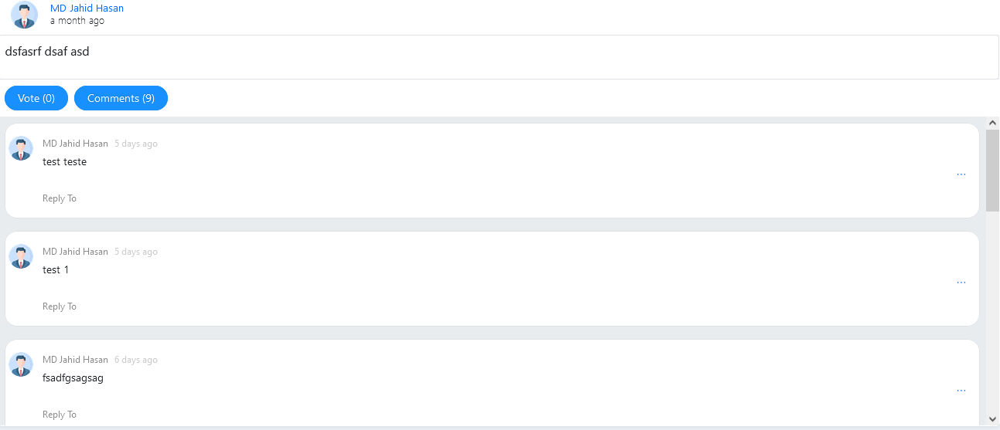

# AstToKnowFrontend
**List of post of all user like social media**


**User can ask private question and question will distribute among the agent based on availability**


**User can comment on public post**


**User can reply on a specific comment**


**Agent can see all the private question that assigned him by system automatically**


**Individual Question page where user can answer question and also can attach media**


## Installation procedure

Two separate project need to setup for run complete application.

**Before start setup make sure are in `dev` branch of repository.**

### Backend(Django)

For implement backend/api I use Django, Django Rest Framework and Postgresql database. For install full project
and dependency follow below instruction,

1. Python3 and Pip and Venv Must be installed in your system
2. Now create a virtual environment and active it.
3Run the command below to install all the packages
   ```
   pip install -r requirements.txt
   ```
   
4. Now go to project directory and run those two commands to create database
tables.
   ```
   python manage.py makemigrations
   python manage.py migrate
   ```
5. Now create a super user by running this command and follow the instruction.
   ```
   python manage.py createsuperuser
   ```
6. Finally Run the project with this command.
   ```
   python manage.py runserver
   ```
   

### Frontend (Angular.js)
Frontend or client side application are implemented with Angular.js that is a javascript
framework. To install this project it is a very easy and simple steps we need to follow.

1. Node and angular cli must be installed in your system.
2. Now go to project directory and run ->
   ```
   npm install
   ```
   This should install all dependencies of the project.
3. Now run this command to deploy project on localhost.
   ```
   ng serve

   ```